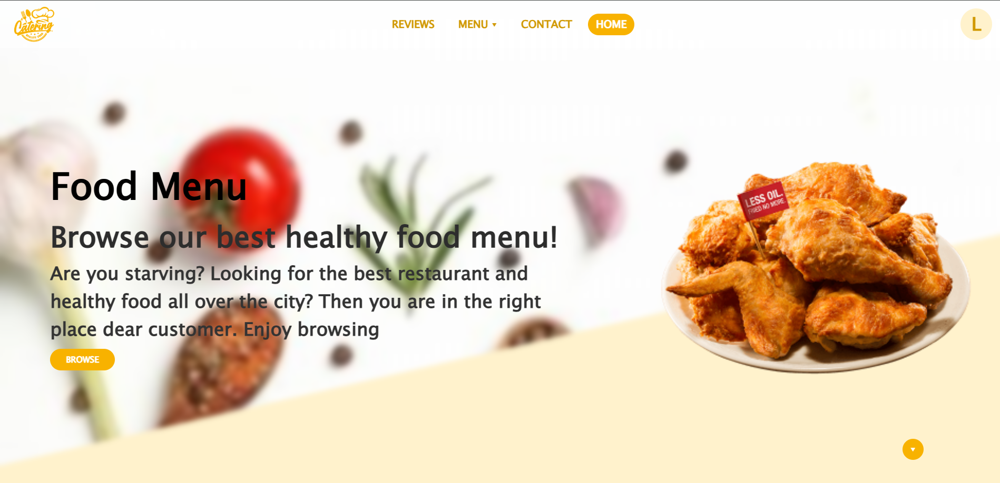
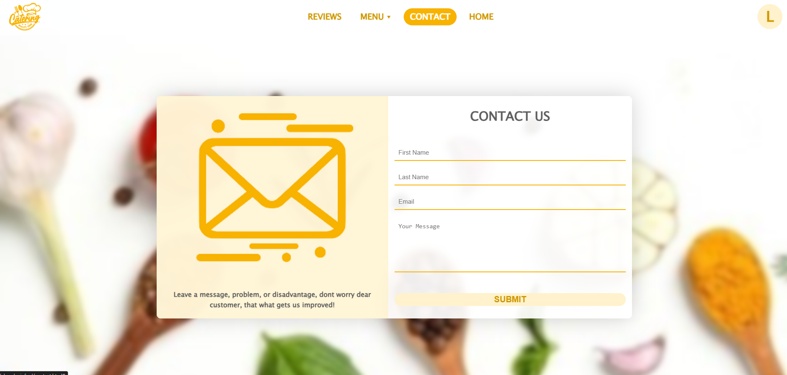
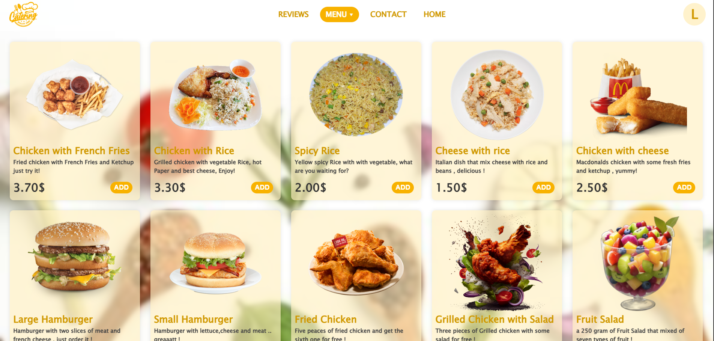
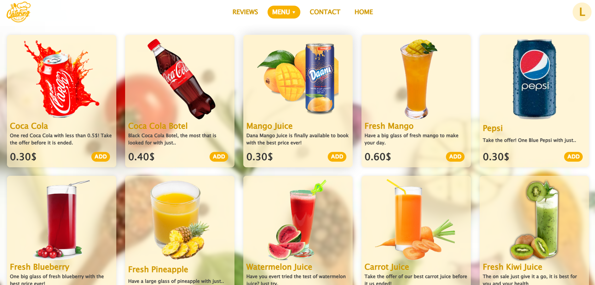
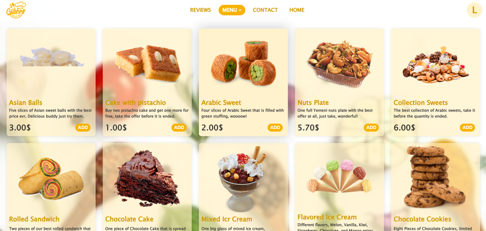
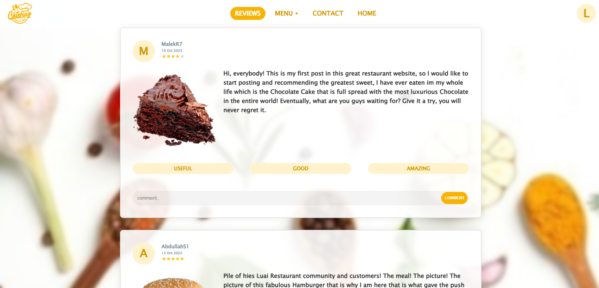

# responsive-UI-UX-resturant-website
This simple UI/UX restaurant website, built with HTML, CSS, and JavaScript, offers a clean, responsive design for all devices. If you find it useful, feel free to contribute by adding features or improving the design!

# The Sign-In/Up Interface
  
### This screen allows users to sign in or create a new account.

# Home - Food
  
### The main home screen showcasing delicious food items.

# Home - Juice
  
### The main home screen showcasing delicious juice items.

# Home - Sweet
  
### The main home screen showcasing delicious sweet items.

# Contact
  
### A page where users can find contact details and get in touch.

# Food Menu
  
### A categorized list of all available food items.

# Juice Menu
  
### A dedicated section for all the refreshing juice options.

# Sweet Menu
  
### A menu displaying various sweet dishes and desserts.

# Reviews
  
### Customer feedback and testimonials about the restaurant.
