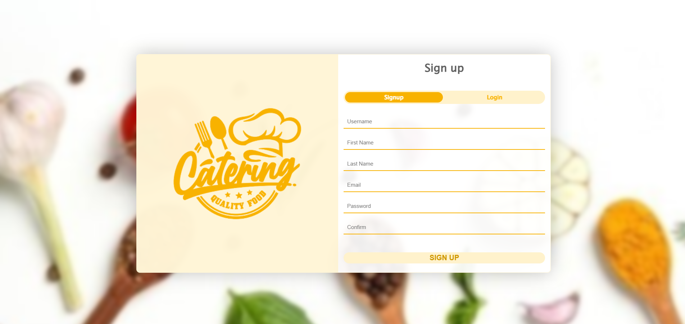

# responsive-UI-UX-resturant-website
This simple UI/UX restaurant website, built with HTML, CSS, and JavaScript, offers a clean, responsive design for all devices. If you find it useful, feel free to contribute by adding features or improving the design!

# The Sign-In/Up Interface
### This screen allows users to sign in or create a new account.
  

# Home - Food
### The main home screen showcasing delicious food items.
  

# Home - Juice
### The main home screen showcasing delicious juice items.
  

# Home - Sweet
### The main home screen showcasing delicious sweet items.
  

# Contact
### A page where users can find contact details and get in touch.
  

# Food Menu
### A categorized list of all available food items.
  

# Juice Menu
### A dedicated section for all the refreshing juice options.
  

# Sweet Menu
### A menu displaying various sweet dishes and desserts.
  

# Reviews
### Customer feedback and testimonials about the restaurant.
  
